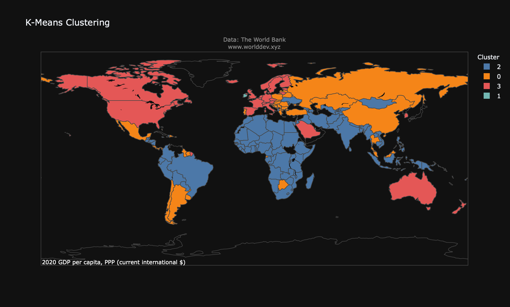
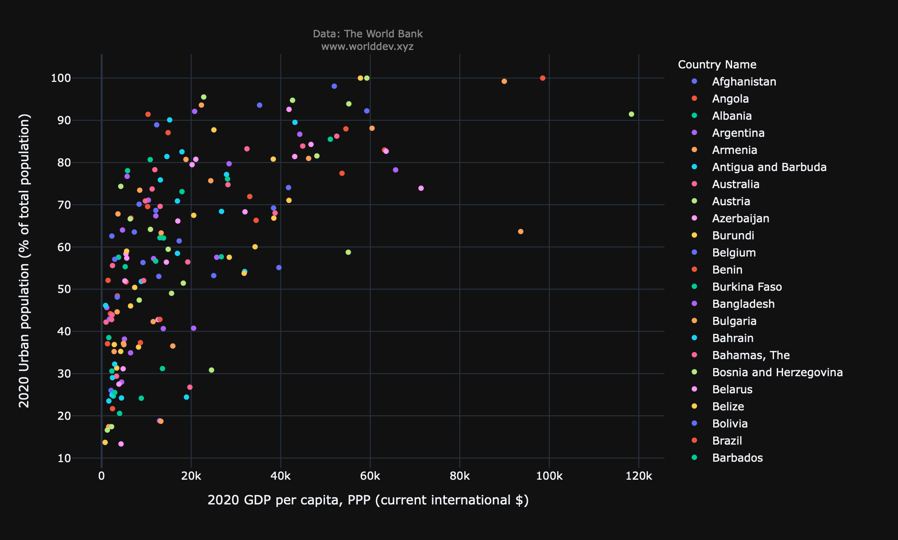

# Does higher urban population result in higher GDP?

## Who Am I?
> My name is Nirav Pancholi. I am a Data Science student at UMBC. I also work fulltime as a software developer at UPS. I am passionate about learning from Data and doing problem solving using that data. 
    
## Thesis
> In this analysis today, we are going to see if higher number of urban population result in higher GDP. Many western countries have believed so. I also believe that urbanization brings more opportunities to public, and hence resulting in higher GDP.
  
## Understanding the data

First, we are going to look at the data that we are using for this analysis. Data used in this analysis are sourced from [World Dev](http://www.worlddev.xyz). For our convenience, we are only going to focus on 2020

1. **GDP per capita**: 

 - Clusters are based on similarities in GDP between them. Ranking from lower GDP to higher GDP respectively 2, 0, 3, 1.
 - We can see, most of the western countries have higher GDP and most of the African and South Asian countries have lower GDP.

2. **Urban Population** (% of total population):

 - Ranking from lower Urban population to higher urban population respectively 2, 0, 3, 1.
 - Like GDP, we can see that most of the western countries have higher urban population. 
 - Russia is one of the exceptions, it could be because it has larger land area and most of the area has extremely cold weather. Hence, not many people live in those areas. So, most of the people live in urban areas.
- Australia is also similar to Russia, most middle part of Australia has extremely hot weather and no water sources. So, majority of the population lives around coastal areas.

## Data Analysis

1. **Scatter Plot**:

 

- From this scatter plot, we can see a pattern and some kind of reverse exponential curve. This helps us understand that as urban population grows, after some point, it directly affects the GDP. From the scatter plot, the breaking point seems to be around 50%. Meaning once a country reaches 50% urban population its GDP is expected to grow.

2. **Correlation between Urban population and GDP:**

> R-squared:                       0.392

- From the OLS Regression, we can see correlation between both variables. [R-squared](https://www.investopedia.com/terms/r/r-squared.asp) shows how much related these two variables are. Almost 40% of the data points from Urban population have straight effect on GDP.

## Conclusions:
> We can conclude that urban population plays major role in a country's GDP. We can also see that; it only plays significant role when Urban population goes above 50%. That means, if a country wants to increase its GDP, then they should focus on getting more than half of the population Urbanized. 
